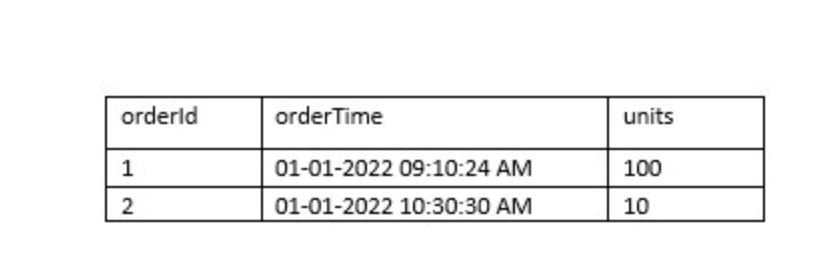

# DBCDEA Test 1

### Question 1: Incorrect
You were asked to create a table that can store the below data, orderTime is a timestamp but the finance team when they query this data normally prefer the orderTime in date format, you would like to create a calculated column that can convert the orderTime column timestamp datatype to date and store it, fill in the blank to complete the DDL.



```
orderId    orderTime                  units

1          01-01-2022 09:10:24 AM.    100
2          01-01-2022 10:30:30 AM.    10 
```

A. AS DEFAULT (CAST(orderTime as DATE))

B. GENERATED ALWAYS AS (CAST(orderTime as DATE))

C. GENERATED DEFAULT AS (CAST(orderTime as DATE))

D. AS (CAST(orderTime as DATE))

E. Delta lake does not support calculated columns, value should be inserted into the table as part of the ingestion process.


Ans: B

References: 

https://docs.databricks.com/en/delta/generated-columns.html


https://docs.microsoft.com/en-us/azure/databricks/delta/delta-batch#--use-generated-columns

Delta Lake supports generated columns which are a special type of columns whose values are automatically generated based on a user-specified function over other columns in the Delta table. When you write to a table with generated columns and you do not explicitly provide values for them, Delta Lake automatically computes the values.


### Question 3

What is the main difference between AUTO LOADER  and COPY INTO?

A. COPY INTO supports schema evolution.

B. AUTO LOADER supports schema evolution.

C. COPY INTO supports file notification when performing incremental loads.

D. AUTO LOADER supports reading data from Apache Kafka

E. AUTO LOADER Supports file notification when performing incremental loads.


Ans: E


#### Explanation

Auto loader supports both directory listing and file notification but `COPY INTO` only supports directory listing.

Auto loader file notification will automatically set up a notification service and queue service that subscribe to file events 
from the input directory in cloud object storage like Azure blob storage or S3. File notification mode is more performant and 
scalable for large input directories or a high volume of files.


### Question 4


Why does AUTO LOADER require schema location?


A. Schema location is used to store user provided schema

B. Schema location is used to identify the schema of target table

C. AUTO LOADER does not require schema location, because its supports Schema evolution

D. Schema location is used to store schema inferred by AUTO LOADER

E. Schema location is used to identify the schema of target table and source table

Ans: D


#### Overall explanation
The answer is, Schema location is used to store schema inferred by AUTO LOADER, so the next time AUTO LOADER runs faster as does not need to infer the schema every single time by trying to use the last known schema.


Auto Loader samples the first 50 GB or 1000 files that it discovers, whichever limit is crossed first. To avoid incurring this inference cost at every stream start up, and to be able to provide a stable schema across stream restarts, you must set the option cloudFiles.schemaLocation.
Auto Loader creates a hidden directory `_schemas` at this location to track schema changes to the input data over time.


#### References:

See https://docs.databricks.com/en/ingestion/auto-loader/options.html


### Question 14: 

If you run the command `VACUUM transactions retain 0 hours`,  What is the outcome of this command?

Ans:


A. Command will be successful, but no data is removed

B. Command will fail if you have an active transaction running

C. Command will fail, you cannot run the command with retentionDurationcheck enabled

D. Command will be successful, but historical data will be removed

E. Command runs successful and compacts all of the data in the table


Ans : C


#### Explanation
The answer is "Command will fail, you cannot run the command with retentionDurationcheck enabled".


VACUUM [ [db_name.]table_name | path] [RETAIN num HOURS] [DRY RUN]
Recursively vacuum directories associated with the Delta table and remove data files that are no longer in the latest state of the transaction log for the table and are older than a retention threshold. Default is 7 Days.

The reason this check is enabled is because, DELTA is trying to prevent unintentional deletion of history, and also one important thing to point out is with 0 hours of retention there is a possibility of data loss(see below kb)

Documentation in VACUUM https://docs.delta.io/latest/delta-utility.html

https://kb.databricks.com/delta/data-missing-vacuum-parallel-write.html


### Question 18 
Which of the following command can be used to drop a managed delta table and the underlying files in the storage?


A. `DROP TABLE table_name CASCADE`

B. `DROP TABLE table_name`

C. Use `DROP TABLE table_name` command and manually delete files using command dbutils.fs.rm("/path",True)

D. `DROP TABLE table_name INCLUDE_FILES`

E. `DROP TABLE table` and run `VACUUM` command


Ans: B


####  Explanation

The answer is DROP TABLE table_name,

A. CASCADE is used only when a schema is dropped Not a table

https://gemini.google.com/app/cadfcbb18857062b


When a managed table is dropped, the table definition is dropped from metastore and everything including data, metadata, and history are also dropped from storage.


The command to drop a table in Databricks SQL is mostly correct, but there's a minor issue:

Correct: `DROP TABLE table_name`

Incorrect: `DROP TABLE table_name CASCADE`

The CASCADE clause is not supported in Databricks SQL for dropping tables. It's a functionality available in some traditional database systems to automatically drop dependent objects (like views or foreign keys) that reference the dropped table.

Databricks SQL doesn't currently support cascading drops. If you try to use it, the command will likely fail or raise an error.


### Question 20 
Which of the following is correct for the global temporary view?


A. global temporary views cannot be accessed once the notebook is detached and attached

B. global temporary views can be accessed across many clusters

C. global temporary views can be still accessed even if the notebook is detached and attached

D. global temporary views can be still accessed even if the cluster is restarted

E. global temporary views are created in a database called temp database

Ans: C

g
### Explanation

The answer is global temporary views can be still accessed even if the notebook is detached and attached


There are two types of temporary views that can be created Local and Global

* A local temporary view is only available with a spark session, so another notebook in the same cluster can not access it. if a notebook is detached and reattached local temporary view is lost.

* A global temporary view is available to all the notebooks in the cluster, even if the notebook is detached and reattached it can still be accessible but if a cluster is restarted the global temporary view is lost

### References

https://medium.com/@saravjeet.singh/databricks-basics-databases-tables-and-views-4e180d7bb293


### Question 28

Which of the following commands results in the successful creation of a view on top of the delta stream(stream on delta table)?

A. `Spark.read.format("delta").table("sales").createOrReplaceTempView("streaming_vw")`

B. `Spark.readStream.format("delta").table("sales").createOrReplaceTempView("streaming_vw")`

C. `Spark.read.format("delta").table("sales").mode("stream").createOrReplaceTempView("streaming_vw")`

D. `Spark.read.format("delta").table("sales").trigger("stream").createOrReplaceTempView("streaming_vw")`

E. `Spark.read.format("delta").stream("sales").createOrReplaceTempView("streaming_vw")`

F. You can not create a view on streaming data source.

Ans: B

####  Explanation


The answer is:

`Spark.readStream.table("sales").createOrReplaceTempView("streaming_vw")`


When you load a Delta table as a stream source and use it in a streaming query, the query processes all of the data present in the table as well as any new data that arrives after the stream is started.

You can load both paths and tables as a stream, you also have the ability to ignore deletes and changes(updates, Merge, overwrites) on the delta table.

Here is more information,

https://docs.databricks.com/delta/delta-streaming.html#delta-table-as-a-source


### Question 29 End-to end Fault tolerance

Which of the following techniques structured streaming uses to create an end-to-end fault tolerance ?

```

   A. Checkpointing and Water marking

   B. Write ahead logging and water marking

   C. Checkpointing and idempotent sinks

   D. Write ahead logging and idempotent sinks

   E. Stream will failover to available nodes in the cluster.

```

Could be C or D 

_____________________________

### Question 30 Auto Loader

Which of the following two options are supported in identifying the arrival of new files, and incremental data from Cloud object storage using Auto Loader?


A. Directory listing, File notification

B. Checking pointing, watermarking

C. Writing ahead logging, read head logging

D. File hashing, Dynamic file lookup

E. Checkpointing and Write ahead logging

Ans: A

_______________________________________


### Question 35 - Incremental Data Processing


When building a DLT s pipeline you have two options to create a live tables, what is the main difference between 
CREATE STREAMING LIVE TABLE vs CREATE LIVE TABLE ?


A. `CREATE STREAMING LIVE table` is used in MULTI HOP Architecture

B. `CREATE LIVE TABLE` is used when working with Streaming data sources and Incremental data

C. `CREATE STREAMING LIVE TABLE` is used when working with Streaming data sources and Incremental data

D. There is no difference both are the same, `CREATE STRAMING LIV`E will be deprecated soon

E. `CREATE LIVE TABLE` is used in DELTA LIVE TABLES, `CREATE STREAMING LIVE` can only used in Structured Streaming applications

Ans: C

https://chatgpt.com/c/98d64112-1a20-461a-9526-3f414ca5e7cf

_____________________________________________________

## Question 38 - SQL Warehouses

You have noticed that Databricks SQL queries are running slow, you are asked to look reason why queries are running slow and identify 
steps to improve the performance, when you looked at the issue you noticed all the queries are running in parallel and using a 
SQL endpoint(SQL Warehouse) with a single cluster. 

Which of the following steps can be taken to improve the performance/response times of the queries?

*Please note Databricks recently renamed SQL endpoint to SQL warehouse.*


A. They can turn on the Serverless feature for the SQL endpoint(SQL warehouse).

B. They can increase the maximum bound of the SQL endpoint(SQL warehouse)’s scaling range

C. They can increase the warehouse size from 2X-Smal to 4XLarge of the SQL endpoint(SQL warehouse).

D. They can turn on the Auto Stop feature for the SQL endpoint(SQL warehouse).

E. They can turn on the Serverless feature for the SQL endpoint(SQL warehouse) and change the Spot Instance Policy to “Reliability Optimized.”

Ans: B


Overall explanation
The answer is, They can increase the maximum bound of the SQL endpoint’s scaling range when you increase the max scaling range more clusters are added so queries instead of waiting in the queue can start running using available clusters, see below for more explanation.


The question is looking to test your ability to know how to scale a SQL Endpoint(SQL Warehouse) and you have to look for cue words or need to understand if the queries are running sequentially or concurrently. if the queries are running sequentially then scale up(Size of the cluster from 2X-Small to 4X-Large) if the queries are running concurrently or with more users then scale out(add more clusters).


SQL Endpoint(SQL Warehouse) Overview: (Please read all of the below points and the below diagram to understand )


A SQL Warehouse should have at least one cluster

A cluster comprises one driver node and one or many worker nodes

No of worker nodes in a cluster is determined by the size of the cluster (2X -Small ->1 worker, X-Small ->2 workers.... up to 4X-Large -> 128 workers) this is called Scale up

A single cluster irrespective of cluster size(2X-Smal.. to ...4XLarge) can only run 10 queries at any given time if a user submits 20 queries all at once to a warehouse with 3X-Large cluster size and cluster scaling (min 1, max1) while 10 queries will start running the remaining 10 queries wait in a queue for these 10 to finish.

Increasing the Warehouse cluster size can improve the performance of a query, for example, if a query runs for 1 minute in a 2X-Small warehouse size it may run in 30 Seconds if we change the warehouse size to X-Small. this is due to 2X-Small having 1 worker node and X-Small having 2 worker nodes so the query has more tasks and runs faster (note: this is an ideal case example, the scalability of a query performance depends on many factors, it can not always be linear)

A warehouse can have more than one cluster this is called Scale out. If a warehouse is configured with X-Small cluster size with cluster scaling(Min1, Max 2) Databricks spins up an additional cluster if it detects queries are waiting in the queue, If a warehouse is configured to run 2 clusters(Min1, Max 2), and let's say a user submits 20 queries, 10 queriers will start running and holds the remaining in the queue and databricks will automatically start the second cluster and starts redirecting the 10 queries waiting in the queue to the second cluster.

A single query will not span more than one cluster, once a query is submitted to a cluster it will remain in that cluster until the query execution finishes irrespective of how many clusters are available to scale.


https://docs.databricks.com/en/compute/sql-warehouse/index.html

__________________________


## Question 39 - SQL Warehouses

You currently working with the marketing team to setup a dashboard for ad campaign analysis, since the team is not sure how often the dashboard should be refreshed they have decided to do a manual refresh on an as needed basis. Which of the following steps can be taken to reduce the overall cost of the compute when the team is not using the compute?

```

A. They can turn on the Serverless feature for the SQL endpoint(SQL Warehouse).

B. They can decrease the maximum bound of the SQL endpoint(SQL Warehouse) scaling range.

C. They can decrease the cluster size of the SQL endpoint(SQL Warehouse).

D. They can turn on the Auto Stop feature for the SQL endpoint(SQL Warehouse).

E. They can turn on the Serverless feature for the SQL endpoint(SQL Warehouse) and change the Spot Instance Policy from “Reliability Optimized” to  “Cost optimized”

```

Ans: D

Overall explanation
The answer is, They can turn on the Auto Stop feature for the SQL endpoint(SQL Warehouse).

_________________


## Question 41

The research team has put together a funnel analysis query to monitor the customer traffic on the e-commerce platform, the query takes about 30 mins to run on a small SQL endpoint cluster with max scaling set to 1 cluster. What steps can be taken to improve the performance of the query?

```
A. They can turn on the Serverless feature for the SQL endpoint.

B. They can increase the maximum bound of the SQL endpoint’s scaling range anywhere from between 1 to 100 to review the performance and select the size that meets the required SLA.

C. They can increase the cluster size anywhere from X small to 3XL to review the performance and select the size that meets the required SLA.

D. They can turn off the Auto Stop feature for the SQL endpoint to more than 30 mins.

E. They can turn on the Serverless feature for the SQL endpoint and change the Spot Instance Policy from “Cost optimized” to “Reliability Optimized.”
```

Ans: C

Overall explanation
The answer is,  They can increase the cluster size anywhere from 2X-Small to 4XL(Scale Up) to review the performance and select the size that meets your SLA. If you are trying to improve the performance of a single query at a time having additional memory, additional worker nodes mean that more tasks can run in a cluster which will improve the performance of that query.

_______________________________________________________________

## Question 44 - Unity Catalog

Which of the following is not a privilege in the Unity catalog?

```
A. SELECT

B. MODIFY

C. DELETE

D. CREATE TABLE

E. EXECUTE
```


Ans: C

Overall explanation
The Answer is DELETE and UPDATE permissions do not exit, you have to use MODIFY which provides both Update and Delete permissions.


Please note: TABLE ACL privilege types are different from Unity Catalog privilege types, please read the question carefully.


Unity Catalog Privileges

https://learn.microsoft.com/en-us/azure/databricks/spark/latest/spark-sql/language-manual/sql-ref-privileges#privilege-types


Table ACL privileges

https://learn.microsoft.com/en-us/azure/databricks/security/access-control/table-acls/object-privileges#privileges


_______________________________

## Practice Test 2

Question 21
Incorrect
Which of the following programming languages can be used to build a Databricks SQL dashboard?

A. Python

B. Scala

C. SQL

D. R


Correct answer: C


Reference: https://docs.databricks.com/en/dashboards/tutorials/create-dashboard.html


### Question 39

What could be the expected output of query `SELECT COUNT (DISTINCT *) FROM user on this table`:

userId   username     email
1        john.smith   john.smith@example.com
2        NULL.        david@clear.com
3.       kevin.smith. kevin.smith@example.com

```
A. 3

B. 2

C. 1 

D. 0

E. NULL
```

Correct answer: B

`Count(DISTINCT *) removes rows with any column with a NULL value`


### Question 40

You are working on a table called orders which contains data for 2021 and you have the second table called orders_archive which contains data for 2020, you need to combine the data from two tables and there could be a possibility of the same rows between both the tables, you are looking to combine the results from both the tables and eliminate the duplicate rows, which of the following SQL statements helps you accomplish this?

```
A. SELECT * FROM orders UNION SELECT * FROM orders_archive

B. SELECT * FROM orders INTERSECT SELECT * FROM orders_archive

C. SELECT * FROM orders UNION ALL SELECT * FROM orders_archive

D. SELECT * FROM orders_archive MINUS SELECT * FROM orders

```
Correct answer: A

UNION and UNION ALL are set operators,

UNION combines the output from both queries but also eliminates the duplicates.

UNION ALL combines the output from both queries.


Question 44

Which of the following operations are not supported on a streaming dataset view?

spark.readStream.format("delta").table("sales").createOrReplaceTempView("streaming_view")


A. `SELECT sum(unitssold) FROM streaming_view`

B. `SELECT max(unitssold) FROM streaming_view`

C. `SELECT id, sum(unitssold) FROM streaming_view GROUP BY id ORDER BY id`

D. `SELECT id, count(*) FROM streaming_view GROUP BY id`

E. `SELECT * FROM streadming_view ORDER BY id`

Correct answer: E


Sorting with Group by will work without any issues


see below explanation for each option of the options,

Sorting is not supported on streaming DataFrames/Datasets, unless it is on aggregated Dataframe/Dataset in
Complete Output mode.

Certain operations are not allowed on streaming data, please see highlighted in bold.


https://spark.apache.org/docs/latest/structured-streaming-programming-guide.html#unsupported-operations


Multiple streaming aggregations (i.e. a chain of aggregations on a streaming DF) are not yet supported on streaming Datasets.

Limit and take the first N rows are not supported on streaming Datasets.

Distinct operations on streaming Datasets are not supported.

Deduplication operation is not supported after aggregation on a streaming Datasets.

Sorting operations are supported on streaming Datasets only after an aggregation and in Complete Output Mode.

        Note: Sorting without aggregation function is not supported.


__________________________


Questions to review - Practice test 3
--------------------------------------
#5 
Question 5:
Which of the following developer operations in the CI/CD can only be implemented through a GIT provider when using
Databricks Repos.

Question 7:
Data science team members are using a single cluster to perform data analysis, although cluster size was chosen to handle multiple users and auto-scaling was enabled, the team realized queries are still running slow, what would be the suggested fix for this?

Question 10:
While investigating a data issue in a Delta table, you wanted to review logs to see when and who updated the table, what is the best way to review this data?

Question 19:
Which of the following table constraints that can be enforced on Delta lake tables are supported?

Question 33:
A DELTA LIVE TABLE pipelines can be scheduled to run in two different modes, what are these two different modes?

Question 39:
The data engineering team is using a SQL query to review data completeness every day to monitor the ETL job, and query output is being used in multiple dashboards which of the following approaches can be used to set up a schedule and automate this process?

Question 43:
A new user who currently does not have access to the catalog or schema is requesting access to the customer table in sales schema, but the customer table contains sensitive information, so you have decided to create view on the table excluding columns that are sensitive and granted access to the view GRANT SELECT ON view_name to user@company.com but when the user tries to query the view, gets the error view does not exist. What is the issue preventing user to access the view and how to fix it?


Question 45:
How do you upgrade an existing workspace managed table to a unity catalog table?


Weak areas

1. Databricks Repos - question 6

2. Logging - DESCRIBE HISTORY instead of SHOW HISTORY - Question 10

3. Constraints - Question 19

Databricks currently support two types of constraints:

 - NOT NULL constraints
 - CHECK constraints

In both cases, you must ensure that no data violating the constraint is already in the table prior to defining the constraint.
Once a constraint has been added to a table, data violating the constraint will result in write failure.


4. Variable interpolation in Python not SQL mode - Question 24

Question is erroneous


5. Schema inference in AUTOLOADER - Question 28. Use cloudFiles.schemaHints

When cloudfiles.schemalocation is used to store the output of the schema inference during the load process,  with schema hints you can enforce data types for known columns ahead of time. 

6. DELTA LIVE TABLE modes - Question 33
   Modes are Triggered, Continuous.

https://docs.databricks.com/en/delta-live-tables/updates.html#continuous-triggered

If the pipeline uses the triggered execution mode, the system stops processing after successfully refreshing all tables or selected tables in the pipeline once, ensuring each table that is part of the update is updated based on the data available when the update started.

If the pipeline uses continuous execution, Delta Live Tables processes new data as it arrives in data sources to keep tables throughout the pipeline fresh.

Delta Live Tables offer two pipeline modes for running data pipelines:

Continuous Execution: In this mode, Delta Live Tables constantly monitor your data sources for new data. As soon as new data arrives, the pipeline processes it to keep all the tables within the pipeline up-to-date. This ensures your data is always fresh.

Manual Triggers: This mode allows you to initiate the pipeline execution yourself, whenever you need the data refreshed. This is useful for scenarios where data updates are not frequent, or you want more control over when the pipeline runs.


7. Tasks that cannot be setup through a job - Quetion 35
  Databricks SQL Dashboard refresh

https://gemini.google.com/app/297e0e1ff1aee05e


Domain : Incremental Data processing

8. Version controllable configuration of the Job’s schedule and configuration? Question 36
   
They can download the JSON equivalent of the job from the Job’s page.

https://gemini.google.com/app/1c506c7ca2b17f1f


Domain: Production Pipelines

9. Dashboard Data Refresh - Question 38


The entire dashboard with 10 queries can be refreshed at once, single schedule needs to be set up to refresh at 8 AM.

Domain: Production Pipelines


https://gemini.google.com/app/1c506c7ca2b17f1f


10. granting update permissions uses MODIFY instead of UPDATE. Need to know the various
access modes in Databricks


GRANT MODIFY ON TABLE table_name TO john.smith@marketing.com

Access privileges on schemas:

```
  USE SCHEMA

  APPLY TAG

  EXECUTE

  MODIFY

  READ VOLUME

  REFRESH

  SELECT

  WRITE VOLUME

  CREATE FUNCTION

  CREATE MATERIALIZED VIEW

  CREATE MODEL

  CREATE TABLE

  CREATE VOLUME
```

Access privileges on tables:

```
  APPLY TAG
  MODIFY
  SELECT
 ```
  
Volumes:
```
  APPLY TAG
  READ VOLUME
  WRITE VOLUME
```
_____________________________________________


# DBCDEA Test 4

## Incorrect answers

### Question 2

Where are Interactive notebook results stored in Databricks product architecture?

A. Data plane

B. Control plane

C. Data and Control plane

D. JDBC data source

E. Databricks web application

Ans: C

#### Explanation

Only Job results are stored in Data Plane(your storage), Interactive notebook results are stored in a combination of the 
control plane (partial results for presentation in the UI) and customer storage.

https://docs.microsoft.com/en-us/azure/databricks/getting-started/overview#--high-level-architecture

By default, interactive notebook results in Databricks are stored in the Databricks-managed control plane [1]. This offers convenience as it removes the need for users to manage storage locations themselves. However, there is also an option to configure your workspace to store these results in your cloud provider's account (e.g., AWS S3 or Azure Blob Storage) [1, 3]. This can be beneficial for reasons like security or cost management.

Here's a summary of the storage options:

Databricks control plane (default): Convenient, good for small results.
Cloud provider storage: Offers more control and security, potentially lower costs, but requires user management of storage location.
Databricks admins can choose the storage location that best suits their organization's needs [1, 3].

https://gemini.google.com/app/7f80486fc9d77b6b


### Question 8


Create a schema called bronze using location ‘/mnt/delta/bronze’, and check if the schema exists before creating.


A. `CREATE SCHEMA IF NOT EXISTS bronze LOCATION '/mnt/delta/bronze'`

B. `CREATE SCHEMA bronze IF NOT EXISTS LOCATION '/mnt/delta/bronze'`

C. `if IS_SCHEMA('bronze'): CREATE SCHEMA bronze LOCATION '/mnt/delta/bronze'`

D. Schema creation is not available in metastore, it can only be done in Unity catalog UI

E. Cannot create schema without a database


Ans: A


#### Overall explanation
https://docs.databricks.com/sql/language-manual/sql-ref-syntax-ddl-create-schema.html


The format of the `CREATE SCHEMA` command is:

`CREATE SCHEMA [ IF NOT EXISTS ] schema_name [ LOCATION schema_directory ]`

### Question 11


When you drop a managed table using SQL syntax DROP TABLE table_name how does it impact metadata, history, and data stored in the table?


A. Drops table from meta store, drops metadata, history, and data in storage.

B. Drops table from meta store and data from storage but keeps metadata and history in storage

C. Drops table from meta store, meta data and history but keeps the data in storage

D. Drops table but keeps meta data, history and data in storage

E. Drops table and history but keeps meta data and data in storage


**Ans: A**


#### Overall explanation

For a managed table, a drop command will drop everything from metastore and storage.


##### DROP TABLE

**Deletes the table and removes the directory associated with the table from the file system if the table is not EXTERNAL table**. 
An exception is thrown if the table does not exist. 
To drop a table you must be its owner, or the owner of the schema, catalog, or metastore the table resides in.

In case of an external table, only the associated metadata information is removed from the metastore schema.

**Metadata:**

   Managed Tables: 

   Dropping a managed table removes all associated metadata from the Databricks metastore. This includes table schema, location of data files, and any access control information.


   External Tables: 

   Dropping an external table only removes the table definition from the metastore. This metadata includes the table schema and the location of the data files. However, information about ownership, permissions, or any table statistics might still reside in the metastore depending on configuration.


**Data Files:**

   Managed Tables: 

   As mentioned earlier, dropping a managed table removes the data files themselves along with the metadata.


   External Tables:

   Dropping an external table has no effect on the data files. They remain in the original storage location outside of Databricks.


#### References

https://docs.databricks.com/en/sql/language-manual/sql-ref-syntax-ddl-drop-table.html

https://gemini.google.com/app/51560ab79991e88d


### Question 31

You are working to set up two notebooks to run on a schedule, the second notebook is dependent on the first notebook but both notebooks need different types of compute to run in an optimal fashion, what is the best way to set up these notebooks as jobs?

A. Use DELTA LIVE PIPELINES instead of notebook tasks

B. A Job can only use single cluster, setup job for each notebook and use job dependency to link both jobs together

C. Each task can use different cluster, add these two notebooks as two tasks in a single job with linear dependency and modify the cluster as needed for each of the tasks

D. Use a single job to setup both notebooks as individual tasks, but use the cluster API to setup the second cluster before the start of second task

E. Use a very large cluster to run both the tasks in a single job


Ans: C

#### Overall explanation

Tasks in Jobs can support different clusters for each task in the same job.


### Question 39

What is the top-level object in unity catalog?


A. Catalog

B. Table

C. Workspace

D. Database

E. Metastore

**Ans: E**


#### Overall explanation

The top-level object in Databricks Unity Catalog is a **Metastore**.

A metastore acts as a central repository for storing metadata about your data and AI assets. 

This includes information like:

* Location of your data tables

* Schema definitions
* Permissions for accessing the data


Metastores provide a way to organize and govern your data assets within Databricks.

#### References

https://gemini.google.com/app/881a4eb4f30bf8f2


### Question 40

One of the team members Steve who has the ability to create views, created a new view called regional_sales_vw on the existing table called sales which is owned by John, and the second team member Kevin who works with regional sales managers wanted to query the data in regional_sales_vw, so Steve granted the permission to Kevin using command

`GRANT VIEW, USAGE ON regional_sales_vw to kevin@company.com` 

but Kevin is still unable to access the view?


A. Kevin needs select access on the table sales

B. Kevin needs owner access on the view regional_sales_vw

C. Steve is not the owner of the sales table

D. Kevin is not the owner of the sales table

E. Table access control is not enabled on the table and view

**Ans: C**

#### Overall explanation

Ownership determines whether or not you can grant privileges on derived objects to other users, 
since Steve is not the owner of the underlying sales table, he can not grant access to the table or data in the table indirectly.


Only owner(user or group) can grant access to a object

#### References

https://docs.microsoft.com/en-us/azure/databricks/security/access-control/table-acls/object-privileges#a-user-has-select-privileges-on-a-view-of-table-t-but-when-that-user-tries-to-select-from-that-view-they-get-the-error-user-does-not-have-privilege-select-on-table


[Data object privileges - Azure Databricks | Microsoft Doc](https://learn.microsoft.com/en-us/azure/databricks/data-governance/table-acls/object-privileges#a-user-has-select-privileges-on-a-view-of-table-t-but-when-that-user-tries-to-select-from-that-view-they-get-the-error-user-does-not-have-privilege-select-on-table)


### Question 43

Which of the following developer operations in CI/CD flow can be implemented in Databricks Repos?

A. Delete branch

B. Trigger Databricks CICD pipeline

C. Commit and push code

D. Create a pull request

E. Approve the pull request

**Ans: C**

**D** is also correct.

#### Overall explanation

The answer is Commit and push code.

#### References

(New) : https://docs.databricks.com/en/repos/ci-cd-techniques-with-repos.html


The Delta Live Tables Pipeline is configured to run in Development mode using the Triggered Pipeline Mode. 
What is the expected outcome after clicking Start to update the pipeline?


All datasets will be updated once and the pipeline will shut down. The compute resources will persist to allow for additional testing.


DLT Development and production modes

When you run your pipeline in development mode, the Delta Live Tables system:

- Reuses a cluster to avoid the overhead of restarts.

- Disables pipeline retries so you can immediately detect and fix errors.

In production mode, the Delta Live Tables system:

- Restarts the cluster for specific recoverable errors, including memory leaks and stale credentials.

- Retries execution in the event of specific errors, for example, a failure to start a cluster.


The Delta Live Table Pipeline is configured to run in Production mode using the continuous Pipeline Mode. 
What is the expected outcome after clicking Start to update the pipeline?

All datasets will be updated continuously and the pipeline will not shut down.
The compute resources will persist with the pipeline.

Delta Live Tables supports two different modes of execution:

Triggered pipelines update each table with whatever data is currently available and then stop the cluster running the pipeline. Delta Live Tables automatically analyzes the dependencies between your tables and starts by computing those that read from external sources. Tables within the pipeline are updated after their dependent data sources have been updated.

Continuous pipelines update tables continuously as input data changes. Once an update is started, it continues to run until manually stopped. Continuous pipelines require an always-running cluster but ensure that downstream consumers have the most up-to-date data


Questions to review - Practice test 4 :  5, 7, 8, 12, 15, 16, 17, 19, 22, 24, 25, 29, 30, 32, 34, 35, 38, 39, 42, 43, 45

_____________________________________________________________


# DBCDEA Test 5

### Question 12

Identify one of the below statements that can query a delta table in PySpark Dataframe API

```
A. spark.read.mode("delta").table("table_name")

B. spark.read.table.delta("table_name")

C. spark.read.table("table_name")

D. spark.read.format("delta").LoadTableAs("table_name")

E. spark.read.format("delta").TableAs("table_name")
```

Ans: C

#### Explanation

Chat GPT

[List the ways to read a delta table in Databricks](https://chatgpt.com/c/112e671d-a537-4268-843c-cce10d9a3a89)

[List the ways to write a delta table in Databricks](https://chatgpt.com/c/25a15a65-f57c-4ef6-ab8f-3fab39588284)


### Question 17

Below sample input data contains two columns, one cartId also known as session id, 
and the second column is called items, every time a customer makes a change to the cart 
this is stored as an array in the table, the Marketing team asked you to create a 
unique list of item’s that were ever added to the cart by each customer, 
fill in blanks by choosing the appropriate array function so the query produces below expected result as shown below.


Schema: cartId INT, items Array<INT>


Sample Input Data

```
cartId   items
1        [1,100,200,300]
1        [1,250,300]
```

Expected Result
```
cartId    items
1         [1,100,200,300,250]
```

Code
```
SELECT cartId, ___ (___(items)) as items
FROM carts GROUP BY cartId
```

A. FLATTEN, COLLECT_UNION

B. ARRAY_UNION, FLATTEN

C. ARRAY_UNION, ARRAY_DISTINT

D. ARRAY_UNION, COLLECT_SET


CREATE OR REPLACE TEMPORARY VIEW carts AS
SELECT cartId, items
FROM VALUES (1, array(1,100,200,300),
            (1, array(1,250,300)) as inline(cartId, items);


Review 12, 13, 15, 17, 18, 19, 20, 26, 27, 33, 39, 40, 41, 42, 43, 44

12 - check if loadTableAs is valid
17 - Difference between COLLECT_SET and ARRAY_DISTINCT ?
18 - Understand ARRAY_FILTER
20 - Understand ARRAY_EXPR

26 - Understand how to get list of all active streams in Spark
33 - Review how constraints and EXPECTATIONS work - default case and violations etc

38 - Lookup query parameters for SQL dashboard
39 - Understand use of Delta cache

42 - Understand the term dynamic access control list in context of UC. I feel that dynamic view functions
     were pre-UC.

Does ARRAY_DISTINCT return an array while COLLECT_SET a set ?


## Sections to read


* [Databrick widgets](https://docs.databricks.com/en/notebooks/widgets.html)

* [Continuous vs Triggered Pipeline Execution](https://docs.databricks.com/en/delta-live-tables/updates.html#continuous-triggered)

* [What are Databricks SQL alerts?](https://docs.databricks.com/en/sql/user/alerts/index.html#what-are-databricks-sql-alerts)


________

## DBCDEA Test 6

### Question 9 Which of the following tasks is not supported by Databricks Repos, and must be performed in your Git provider ?


A. Clone, push to, or pull from a remote Git repository.

B. Create and manage branches for development work.

C. Create notebooks, and edit notebooks and other files.

D. Visually compare differences upon commit.

E. Delete branches

Ans: E

#### Overall explanation

The following tasks are not supported by Databricks Repos, and must be performed in your Git provider:

 * Create a pull request

 * Delete branches

* Merge and rebase branches *


* NOTE: Recently, merge and rebase branches have become supported in Databricks Repos. However, this may still not be updated in the current exam version.

Reference:

https://learn.microsoft.com/en-us/azure/databricks/repos/git-operations-with-repos?source=recommendations

### Question 16

Which of the following commands can a data engineer use to create a new table along with a comment ?

```
A. CREATE TABLE payments
   COMMENT "This table contains sensitive information"
   AS SELECT * FROM bank_transactions

B. CREATE TABLE payments
   COMMENT("This table contains sensitive information")
   AS SELECT * FROM bank_transactions

C. CREATE TABLE payments
   AS SELECT * FROM bank_transactions
   COMMENT "This table contains sensitive information"

D. CREATE TABLE payments
   AS SELECT * FROM bank_transactions
   COMMENT("This table contains sensitive information")

E. COMMENT("This table contains sensitive information")
   CREATE TABLE payments
   AS SELECT * FROM bank_transactions
```

Ans : A
#### Overall explanation

The CREATE TABLE clause supports adding a descriptive comment for the table. This allows for easier discovery of table contents.


**Syntax**:

	CREATE TABLE table_name
	COMMENT "here is a comment"
	AS query


Reference: https://docs.databricks.com/sql/language-manual/sql-ref-syntax-ddl-create-table-using.html


### Question 18

A data engineer is designing a Delta Live Tables pipeline. The source system generates files containing changes captured in the source data. Each change event has metadata indicating whether the specified record was inserted, updated, or deleted. In addition to a timestamp column indicating the order in which the changes happened. The data engineer needs to update a target table based on these change events.

Which of the following commands can the data engineer use to best solve this problem?

```
A. MERGE INTO

B. APPLY CHANGES INTO

C. UPDATE

D. COPY INTO

E. cloud_files
```

Ans: B

#### Overall explanation

The events described in the question represent Change Data Capture (CDC) feed. CDC is logged at the source as events that contain both the data of the records along with metadata information:

Operation column indicating whether the specified record was inserted, updated, or deleted

Sequence column that is usually a timestamp indicating the order in which the changes happened

You can use the `APPLY CHANGES INTO` statement to use Delta Live Tables CDC functionality


Reference: https://docs.databricks.com/workflows/delta-live-tables/delta-live-tables-cdc.html


### Question 26

Which of the following is used by Auto Loader to load data incrementally?

A. DEEP CLONE

B. Multi-hop architecture

C. COPY INTO

D.  Spark Structured Streaming

E. Databricks SQL

Ans: D

#### Overall explanation
Auto Loader is based on Spark Structured Streaming. It provides a Structured Streaming source called cloudFiles.


Reference: https://docs.databricks.com/ingestion/auto-loader/index.html


### Question 34

A data engineer has the following query in a Delta Live Tables pipeline:


	  CREATE LIVE TABLE aggregated_sales
	  AS SELECT store_id, sum(total)
	  FROM cleaned_sales
	  GROUP BY store_id


The pipeline is failing to start due to an error in this query


Which of the following changes should be made to this query to successfully start the DLT pipeline ?

```
A. CREATE STREAMING TABLE aggregated_sales
   AS SELECT store_id, sum(total)
   FROM LIVE.cleaned_sales
   GROUP BY store_id

B. CREATE TABLE aggregated_sales
   AS SELECT store_id, sum(total)
   FROM LIVE.cleaned_sales
   GROUP BY store_id

C. CREATE LIVE TABLE aggregated_sales
   AS SELECT store_id, sum(total)
   FROM LIVE.cleaned_sales
   GROUP BY store_id

D. CREATE STREAMING LIVE TABLE aggregated_sales
   AS SELECT store_id, sum(total)
   FROM cleaned_sales
   GROUP BY store_id

E. CREATE STREAMING LIVE TABLE aggregated_sales
   AS SELECT store_id, sum(total)
   FROM STREAM(cleaned_sales)
   GROUP BY store_id
```
#### Overall explanation

In DLT pipelines, we use the CREATE LIVE TABLE syntax to create a table with SQL. 
To query another live table, prepend the LIVE. keyword to the table name.


	CREATE LIVE TABLE aggregated_sales
	AS SELECT store_id, sum(total)
	FROM LIVE.cleaned_sales
    GROUP BY store_id


Reference: https://docs.databricks.com/workflows/delta-live-tables/delta-live-tables-sql-ref.html

## My Questions


My question


Which of the following enable us to execute a single micro-batch to process all the available streaming data and then stop on its own ?

A. .trigger(processingTime="Once")
B. .trigger(availableNow=True)
C. .trigger(processingTime="0")
D. .trigger(availableNow=Yes)

Ans: B

Which of the following enable us to execute a single micro-batch to process all the available streaming data every 10 seconds ?

A. .trigger(processingTime="10")
B. .trigger(availableNow="10")
C. .trigger(processingTime="10 seconds")
D. .trigger(availableNow="10 seconds")

Ans: C


If no argument to `.trigger()` isspecified, what is the default processing time for Structured Streaming ?
A. 100ms
B. 1 second
C. 10 seconds
D. 500ms

Ans: D


https://docs.databricks.com/data-engineering/delta-live-tables/delta-live-tables-concepts.html#delta-live-tables-concepts


### Databricks Repos

Databricks Repos supports the following operations:


* Create a new branch
* Switch to a different branch
* Commit and push changes to the remote Git repository
* Pull changes from the remote Git repository
* Merge branches
* Rebase a branch on another branch
* Resolve merge conflicts
* Git reset

It does **NOT** support:

* Delete a branch
* Create and approve pull requests
* Trigger Databricks CICD pipeline


